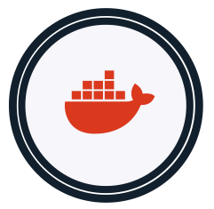

# Radiuss Docker

This project is part of [RADIUSS](https://computing.llnl.gov/projects/radiuss), which
has a focus on helping open source scientific projects use best practices for
automation and development.

This repository contains Dockerfiles for CI builds for use by the various
[RADIUSS](https://software.llnl.gov/radiuss/) projects, and anyone else that
might be interested. The image builds are automated and self-updating, and process
described more below in detail. You can see the listing of updated builds at:

⭐️ [RADIUSS DOCKER BUILDS TABLE](https://rse-radiuss.github.io/docker-images/) ⭐️

## How does it work?

We use a tool called [uptodate](https://github.com/vsoch/uptodate) run as a [GitHub Action](https://vsoch.github.io/uptodate/docs/#/user-guide/github-action) that makes it easy to:

 - [Update Dockerfiles](https://vsoch.github.io/uptodate/docs/#/user-guide/user-guide?id=dockerfile): meaning that we run a nightly job to ensure our base images have the latest hashes, with possibly security updates, etc.
 - [New Dockerfiles](https://vsoch.github.io/uptodate/docs/#/user-guide/user-guide?id=docker-hierarchy): allows us to automatically detect new tags available for one of our base images, and generate a new Dockerfile to build. 
 - [Run Matrix Builds](https://vsoch.github.io/uptodate/docs/#/user-guide/user-guide?id=docker-build): meaning that we can (also on a nightly basis) run a matrix of builds based on a configuration file.
  
For the last two (`dockerhierarchy` and `dockerbuild` for creating new Dockerfiles and running Docker matrix builds, since
there is some configuration required to write down our preferences (e.g., "Add versions greater than this that match this regular expression") you'll find `uptodate.yaml` files scattered across the repository with these preferences.
The root directory they are found in determines their scope (and the content they will be updating or parsing).
The two keys you will see in the file are `dockerhierarchy` and `dockerbuild` for the last two bullets.
More detail of how this works in context of our needs to build base and higher level images is detailed below.

## Base Images

A core base image is considered the lowest level - an operating system with
only a handful of additional dependencies that won't vary with the operating system.
Since the lab heavily uses spack and it makes installing software easy, we also install spack.
For comparison with the [previous axom repository](https://github.com/LLNL/axom-docker), 
Currently, the following directories hold base images:

 - [ubuntu](ubuntu): builds ubuntu bases. The subfolders (e.g., clang, gcc) are for matrix builds.

In the `uptodate.yaml` here you'll find the `dockerhierarchy` key, which means we always want
to maintain subfolders that correspond with the latest tags of the ubuntu image.
A folder that does not correspond to a tag (e.g., clang) is a matrix build, and only
organized as such to indicate that it uses the ubuntu base. Matrix builds are discussed next.

## Matrix Images

A matrix image uses a base image, as described above, to create a matrix of different
builds. This means that the `uptodate.yaml` in some root directory will have a `dockerbuild`
section that specifies how to generate the matrices. You'll also notice, thus, that
the Dockerfile found under this root use build arguments. 
This is a different approach than a core base image because unlike base images that can
vary, for matrix builds we want to use a common template with different build arguments.

## Interface

After an image is built and deployed, an entry is generated for the [library interface](https://rse-radiuss.github.io/docker-images/).
This includes names, versions, and links to metadata to further inspect or interact with the images. The interface also exposes
a [RESTful endpoint](https://rse-radiuss.github.io/docker-images/library.json) in case you'd like to interact programatically.

License
-------

Copyright (c) 2017-2021, Lawrence Livermore National Security, LLC. 
Produced at the Lawrence Livermore National Laboratory.

RADIUSS Docker is licensed under the MIT license [LICENSE](./LICENSE).

Copyrights and patents in the RADIUSS Docker project are retained by
contributors. No copyright assignment is required to contribute to RADIUSS
Docker.

This work was produced under the auspices of the U.S. Department of
Energy by Lawrence Livermore National Laboratory under Contract
DE-AC52-07NA27344.
