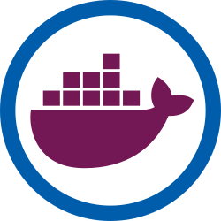

# RSE-ops Docker



**This repository is no longer building updated images. Please see https://github.com/LLNL/radiuss-docker for updated images**

[](https://github.com/rse-ops/radius-docker/blob/main/LICENSE)

This repository contains Dockerfiles for CI builds for any project that might
be interested. The image builds are automated and self-updating, and process
described more below in detail. You can see the listing of updated builds at:

⭐️ [RSE-OPS DOCKER BUILDS TABLE](https://rse-ops.github.io/docker-images/) ⭐️

## How does it work?

We use a tool called [uptodate](https://github.com/vsoch/uptodate) run as a [GitHub Action](https://vsoch.github.io/uptodate/docs/#/user-guide/github-action) that makes it easy to:

 - [Update Dockerfiles](https://vsoch.github.io/uptodate/docs/#/user-guide/user-guide?id=dockerfile): meaning that we run a nightly job to ensure our base images have the latest hashes, with possibly security updates, etc.
 - [New Dockerfiles](https://vsoch.github.io/uptodate/docs/#/user-guide/user-guide?id=docker-hierarchy): allows us to automatically detect new tags available for one of our base images, and generate a new Dockerfile to build. 
 - [Run Matrix Builds](https://vsoch.github.io/uptodate/docs/#/user-guide/user-guide?id=docker-build): meaning that we can (also on a nightly basis) run a matrix of builds based on a configuration file.
  
For the last two (`dockerhierarchy` and `dockerbuild` for creating new Dockerfiles and running Docker matrix builds, since
there is some configuration required to write down our preferences (e.g., "Add versions greater than this that match this regular expression") you'll find `uptodate.yaml` files scattered across the repository with these preferences.
The root directory they are found in determines their scope (and the content they will be updating or parsing).
The two keys you will see in the file are `dockerhierarchy` and `dockerbuild` for the last two bullets.
More detail of how this works in context of our needs to build base and higher level images is detailed below.

### Base Images

A core base image is considered the lowest level - an operating system with
only a handful of additional dependencies that won't vary with the operating system.
Since the lab heavily uses spack and it makes installing software easy, we also install spack.
For comparison with the [previous axom repository](https://github.com/LLNL/axom-docker), 
Currently, the following directories hold base images:

 - [ubuntu](ubuntu): builds ubuntu bases. The subfolders (e.g., clang, gcc) are for matrix builds.
 - [alpine](alpine): a smaller image with alpine (probably mostly for testing)

In the `uptodate.yaml` here you'll find the `dockerhierarchy` key, which means we always want
to maintain subfolders that correspond with the latest tags of the ubuntu image.
A folder that does not correspond to a tag (e.g., clang) is a matrix build, and only
organized as such to indicate that it uses the ubuntu base. Matrix builds are discussed next.

### Matrix Images

A matrix image uses a base image, as described above, to create a matrix of different
builds. This means that the `uptodate.yaml` in some root directory will have a `dockerbuild`
section that specifies how to generate the matrices. How are these triggered? When a matrix
build is done, the build args that are containers are added as labels. Then when a nightly check
is done, we compare the current labels from [a config manifest](https://crane.ggcr.dev/config/ghcr.io/rse-ops/ubuntu:18.04)
with the latest tags found for the container build args, and re-build if they are different,
or if there are latest build args found but no labels for it (indicating a change in the image).

You'll also notice, thus, that the Dockerfile found under this root use build arguments. 
This is a different approach than a core base image because unlike base images that can
vary, for matrix builds we want to use a common template with different build arguments.

### Dockerfiles

For any Dockerfile in the repository that has a FROM statement (that doesn't use a build arg)
we also check for updated hashes for that particular tag. For build arguments that follow
[any of these patterns](https://vsoch.github.io/uptodate/docs/#/user-guide/user-guide?id=build-arguments) 
we can also easily update versions of build args that are
versions from spack, GitHub repository releases or commits, or container identifiers.

### Interface

After an image is built and deployed, an entry is generated for the [library interface](https://rse-ops.github.io/docker-images/).
This includes names, versions, and links to metadata to further inspect or interact with the images. The interface also exposes
a [RESTful endpoint](https://rse-ops.github.io/docker-images/library.json) in case you'd like to interact programatically.


## How do I...

### 1. Add a new base image?

A base image is some derivative of an existing OS image (e.g., ubuntu or alpine from Docker Hub) that you want to add some
special sauce to, like some editors, compilers, or spack. To add a base image you should ask and answer the following questions.

1. You will need to create a new folder for your image. E.g., the docker hub ubuntu `FROM` that we extend on maps to [ubuntu](ubuntu), and a similar ubuntu image with nvidia drivers is [nvidia-ubuntu](nvidia-ubuntu). 
2. Create subfolders that correspond to the tags that you want, and in each one write a Dockerfile. You can look at [ubuntu](ubuntu) as an example. Generally, we have multiple `Dockerfile`s like this for base images because each is different enough to make it hard to template.
3. Add an uptodate.yaml in the root directory (e.g., `ubuntu/uptodate.yaml`). You'll want to define a [docker hierarchy](https://vsoch.github.io/uptodate/docs/#/user-guide/user-guide?id=docker-hierarchy) that tells the nightly updater how to look for new tags (versions) that will be created as new directories. As an example, see below.
4. Open a pull request, communicate the gist of your changes, and ask any questions that you might have.


```yaml
dockerhierarchy:
  container:
    name: ubuntu
    filter: 
     # we only want XX.04 versions
     - "^[0-9]+[.]04$"
    startat: "16.04"
    
    # Versions to skip (not LTS releases)
    skips:
      - "17.04"
      - "19.04"
      - "21.04"
```

### 2. Add a new matrix image?

A matrix image is what you want when you have a particular base image that you want to iterate some number of versions / variables for, and this means using a common Dockerfile. E.g., "I want to use the base ghcr.io/rse-ops/ubuntu:20.04 and build with three versions of library X. To add a matrix build you should:

1. Determine if the base container you want to use is represented here. E.g., the ghcr.io/rse-ops/ubuntu container is built from ubuntu. If we wanted to do a matrix build of cuda, we might create the directory [ubuntu/cuda](ubuntu/cuda) (news flash, we already have that one!) You don't need to worry about the hierarchy of the ubuntu folder being tags as long as the directory you write is not a known tag that is specified to parse (in this case matching the pattern XX.04 for LTS versions). The directory "cuda" will be safely ignored!
2. In this directory, write a Dockerfile that accepts one or more build args for variables that you want to iterate over.
3. Also in this directory, write an uptodate.yaml that includes one or more buildargs that can be hard coded variables, spack packages, or other containers. See the subfolders of [ubuntu](ubuntu) that have `dockerbuild` in the uptodate.yaml for an example.
4. Open a pull request, communicte the gist of your contribution, and ask any questions!

Here is an example of an uptodate.yaml that will create a build matrix of ubuntu versions and spack packages:

```yaml
dockerbuild:
  build_args:
    cuda_version:
      key: cuda
      versions:
       - "10.1.243"
       - "11.0.3"
       - "11.1.1"
       - "11.2.2"
       - "11.3.1"
       - "11.4.0"

    # Look for ubuntu versions for our base builds
    ubuntu_version:
      key: ubuntu
      name: ghcr.io/rse-ops/ubuntu
      type: container
      startat: "20.04"
      filter: 
        - "^[0-9]+[.]04$"
```
For more details on creating a docker build matrix, see the [uptodate docs](https://vsoch.github.io/uptodate/docs/#/user-guide/user-guide?id=docker-build).

And if there is another type of build you want to add not represented here, please [open an issue](https://github.com/rse-ops/docker-images/issues).

License
-------

Copyright (c) 2017-2021, Lawrence Livermore National Security, LLC. 
Produced at the Lawrence Livermore National Laboratory.

RADIUSS Docker is licensed under the MIT license [LICENSE](./LICENSE).

Copyrights and patents in the RADIUSS Docker project are retained by
contributors. No copyright assignment is required to contribute to RADIUSS
Docker.

This work was produced under the auspices of the U.S. Department of
Energy by Lawrence Livermore National Laboratory under Contract
DE-AC52-07NA27344.
